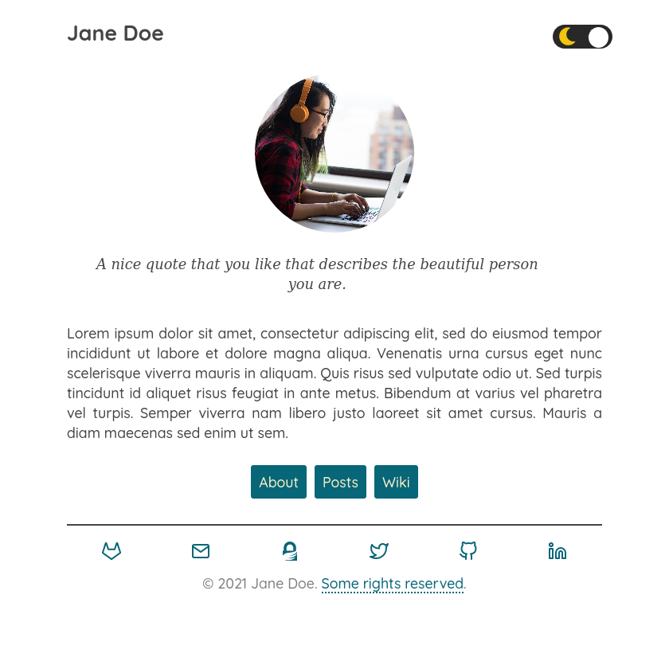

# Gruvhugo
[](https://gitlab.com/avron/gruvhugo/-/commits/master)
[](https://www.gnu.org/licenses/gpl-3.0)

This is a minmal theme based on the [Gruvbox](https://github.com/morhetz/gruvbox) color scheme by [Pavel Pertsev](https://github.com/morhetz/)




# Feature
- **Minimalism is the norm here** 
- **Fast.**
- Highly customizable
  - Almost every piece of text you see is customizable.
  - Customizable Pictures
  - Customizable Menu 
- Fully responsive
- Support for social icons
- **Theming**: dark/light mode, depending on your preferences
- **Proper Testing:** Theme tested for Archlinux, Debian GNU/Linux and Fedora using Gitlab CI. 

## Installation
Adding theme as a sub-module is by the most efficient way to do things in my opinion. If you wish to use the theme as it is then all you need to do add the sub-module but if you wish to modify and maintain your own fork of the theme then make the necessary changes to the git remotes as you see fit.

``` sh
$ git submodule add https://gitlab.com/avron/gruvhugo.git
```
## Configuration
Like almost every other Hugo the config file is placed in exampleSite/config.toml which looks more or less like this:

``` toml
# Hey, thanks for using my theme. If you like this theme,checkout my repo (https://gitlab.com/avron/gruvhugo"
# and drop a star while you're at it. ;)
baseurl = "https://examplesite.com/"
title = "Jane Doe"
languageCode = "en-us"
paginate = "10" # Number of posts per page
#disqusShortname = "" # Enable comments by entering your Disqus shortname
#googleAnalytics = "" # Enable Google Analytics by entering your tracking id
#-------------------------------------------------------------------------------
# DEFAULT SETTINGS
#-------------------------------------------------------------------------------

# Default Theme
theme= "gruvhugo"

# Default Post Extension
defaultExtension= "html"

# Default metadata format for newly created frontmatter using
# hugo new command. "toml", "yaml", or "json"
metaDataFormat= "yaml"

[taxonomies]
  tag      = "tags"
  category = "categories"
  series   = "series"

[params.main]
  enabled = true
  name = "jane_doe"
  img = "img/author.jpg"
  # Thanks to Christina @ wocintechchat.com for this photo.
  icon = "img/logo.png"
  quote = "A nice quote that you like that describes the beautiful person you are."
  description= "Lorem ipsum dolor sit amet, consectetur adipiscing elit, sed do eiusmod tempor incididunt ut labore et dolore magna aliqua. Venenatis urna cursus eget nunc scelerisque viverra mauris in aliquam. Quis risus sed vulputate odio ut. Sed turpis tincidunt id aliquet risus feugiat in ante metus. Bibendum at varius vel pharetra vel turpis. Semper viverra nam libero justo laoreet sit amet cursus. Mauris a diam maecenas sed enim ut sem."

 # Social icons
  [[params.social]]
    name = "gitlab"
    url  = "https://gitlab.com/avron/gruvhugo"

  [[params.social]]
    name = "email"
    url  = "mailto:mail@mail.com"

  [[params.social]]
    name = "gpg"
    url  = "https://keys.openpgp.org/"

  [[params.social]]
    name = "twitter"
    url  = "https://twitter.com/"

  [[params.social]]
    name = "github"
    url  = "https://github.com/"

  [[params.social]]
    name = "linkedin"
    url  = "https://www.linkedin.com/"

[menu]
  [[menu.main]]
    identifier = "about"
    name       = "About"
    url        = "about"

  [[menu.main]]
    identifier = "posts"
    name       = "Posts"
    url        = "post/"

  [[menu.main]]
    identifier = "wiki"
    name       = "Wiki"
    url        = "none"
```

## Contributing
Issues and merge requests for bug fixes and enhancements are welcome.

## Licence
The theme is released under the GPL v3 License.
